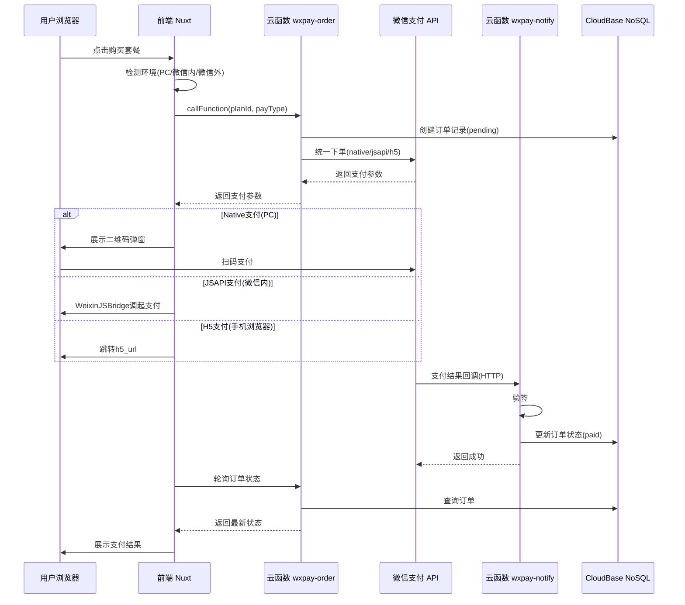
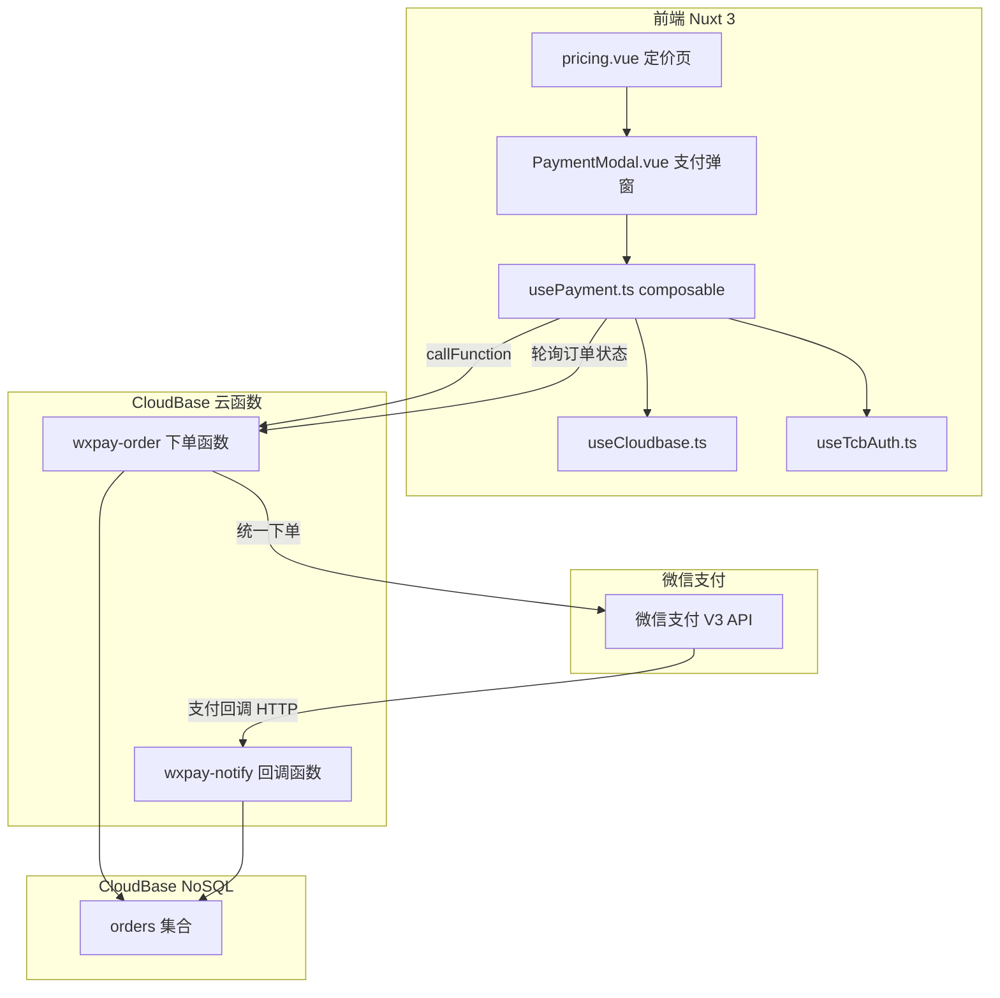

## 产品概述

为云乐坊（www.yunle.fun）SaaS 平台的 Pricing 定价页接入微信支付功能，使用户可以在线购买套餐/会员。系统需根据用户访问环境（PC 浏览器、微信内浏览器、微信外手机浏览器）自动选择最合适的支付方式：Native 扫码支付、JSAPI 支付或 H5 支付。

## 核心功能

1. **套餐购买流程**：用户在 Pricing 页选择套餐并点击购买按钮，触发下单流程；未登录时引导先登录
2. **智能支付方式选择**：自动检测 UA 环境，PC 端使用 Native 扫码支付（展示二维码弹窗），微信内使用 JSAPI 支付，微信外手机浏览器使用 H5 支付
3. **云函数下单**：前端通过 CloudBase SDK 调用云函数，云函数负责调用微信支付 V3 API 创建预付单
4. **支付回调处理**：云函数接收微信支付异步通知，验签并更新订单状态
5. **订单管理**：在 CloudBase NoSQL 数据库中创建 orders 集合存储订单数据，包含套餐信息、支付状态、用户关联
6. **支付结果展示**：支付完成后弹窗提示结果，前端轮询订单状态确认支付
7. **商户配置占位**：通过云函数环境变量存储商户号、API 密钥等敏感信息，代码框架先搭建好，商户信息后续配置

## 技术栈

- **前端框架**: Nuxt 3 + Vue 3 + TypeScript（沿用现有项目）
- **UI 组件库**: Nuxt UI（沿用现有项目）
- **后端**: CloudBase 云函数（Node.js serverless，runtime: Nodejs18.15）
- **数据库**: CloudBase NoSQL（沿用现有 `useCloudbase()` 模式）
- **前端 SDK**: `@cloudbase/js-sdk`（已集成）
- **云函数 SDK**: `@cloudbase/node-sdk`（云函数内使用）
- **微信支付**: 手动实现 V3 API 签名（云函数中直接调用，减少依赖体积）
- **二维码生成**: `qrcode`（前端 Native 支付场景下生成支付二维码）

## 实现方案

### 整体架构

采用前后端分离的支付架构：前端负责环境检测、支付方式选择、支付交互（二维码展示 / 跳转 / 调起 JSAPI）；后端（CloudBase 云函数）负责订单创建、调用微信支付 V3 API 下单、接收支付回调通知、更新订单状态。

### 关键技术决策

1. **为什么使用云函数而非 CloudRun**：用户明确选择云函数；支付场景调用频率不高，serverless 更经济；云函数可通过 `callFunction` 从前端直接调用，无需额外 CORS 配置。

2. **支付方式自动选择策略**：

- PC 端（非移动设备）-> Native 支付：调用 `/v3/pay/transactions/native`，返回 `code_url`，前端生成二维码
- 微信内浏览器（UA 包含 MicroMessenger）-> JSAPI 支付：需要微信 openid，调用 `/v3/pay/transactions/jsapi`，返回 `prepay_id`，通过 WeixinJSBridge 调起支付
- 微信外手机浏览器 -> H5 支付：调用 `/v3/pay/transactions/h5`，返回 `h5_url`，跳转到微信完成支付

3. **云函数设计**：创建 2 个云函数

- `wxpay-order`：处理下单逻辑（创建订单记录 + 调用微信支付统一下单 API）+ 查询订单状态
- `wxpay-notify`：接收微信支付回调通知（HTTP Access 模式，验签 + 更新订单状态）

4. **订单数据模型**：使用 CloudBase NoSQL `orders` 集合，存储用户ID、套餐信息、金额、支付方式、订单状态、微信交易号等

5. **安全设计**：

- 商户密钥通过云函数环境变量配置，不暴露到前端
- 回调通知使用微信支付 V3 签名验证
- 订单金额在后端根据套餐 ID 查表确定，防止前端篡改

### 支付流程



## 实现要点

1. **复用现有模式**：新增的 `usePayment.ts` composable 复用 `useCloudbase()` 获取 SDK 实例和 `useTcbAuth()` 获取用户信息，与现有代码模式一致
2. **Pricing 页面改造**：当前 `/pricing` 是预渲染页面，支付交互部分需在客户端处理；需修改 `nuxt.config.ts` 将 `/pricing` 从预渲染改为 `ssr: false`（因为支付流程依赖客户端 CloudBase Auth 检查登录状态）
3. **云函数环境变量**：`WX_MCH_ID`、`WX_SERIAL_NO`、`WX_PRIVATE_KEY`、`WX_APIV3_KEY`、`WX_APPID`、`WX_NOTIFY_URL` 通过 `createFunction` 的 `envVariables` 参数预留占位
4. **错误处理**：网络异常、支付超时、重复支付等场景需要完善的错误提示，复用现有 `getErrorMessage()` 模式
5. **qrcode 依赖**：仅前端使用，需加入 `package.json` dependencies
6. **微信支付 V3 签名**：在云函数中手动实现，使用 Node.js 内置 `crypto` 模块，避免引入大型第三方 SDK 影响冷启动速度

## 架构设计



## 目录结构

```
project-root/
├── app/
│   ├── types/
│   │   └── payment.ts              # [NEW] 支付相关类型定义。包含 PayType（native/jsapi/h5）、OrderStatus（pending/paid/failed/closed）、PlanId（basic/standard/premium）、BillingCycle（month/year）、OrderRecord 接口、CreateOrderParams 接口、套餐价格配置表 PLAN_PRICES。
│   ├── composables/
│   │   └── usePayment.ts           # [NEW] 支付核心 composable。实现 detectPayType() 环境检测（通过 UA 判断）、createOrder() 下单请求（通过 callFunction 调用云函数）、pollOrderStatus() 轮询订单状态、三种支付方式的前端处理逻辑。复用 useCloudbase() 和 useTcbAuth()。
│   ├── components/
│   │   └── PaymentModal.vue        # [NEW] 支付弹窗组件。使用 UModal，展示套餐确认信息、Native 支付二维码（qrcode 生成 canvas）、支付等待状态、支付结果（成功/失败）。支持三种支付方式的不同 UI 状态切换。
│   └── pages/
│       └── pricing.vue             # [MODIFY] 改造定价页。为每个套餐按钮绑定 handlePurchase 事件，集成 PaymentModal 组件，添加登录检查（未登录跳转 /login?redirect=/pricing）。
├── functions/
│   ├── wxpay-order/
│   │   ├── index.js                # [NEW] 下单云函数入口。处理 action 分发：createOrder（创建订单+微信支付统一下单）、queryOrder（查询订单状态）。包含 V3 API 签名工具函数（使用 Node.js crypto）、三种支付方式下单逻辑、套餐价格服务端校验。
│   │   └── package.json            # [NEW] 依赖 @cloudbase/node-sdk。
│   └── wxpay-notify/
│       ├── index.js                # [NEW] 回调云函数入口。接收微信支付 POST 通知，V3 签名验证，AES-256-GCM 解密通知数据，更新 orders 集合订单状态。需配置 HTTP Access。
│       └── package.json            # [NEW] 依赖 @cloudbase/node-sdk。
├── nuxt.config.ts                  # [MODIFY] 将 /pricing 路由规则从 prerender: true 改为 ssr: false。
├── package.json                    # [MODIFY] 添加 qrcode 依赖。
└── cloudbaserc.json                # [MODIFY] 在 functions 数组中注册两个云函数。
```

## 关键代码结构

```typescript
// app/types/payment.ts

/** 支付方式 */
export type PayType = 'native' | 'jsapi' | 'h5'

/** 订单状态 */
export type OrderStatus = 'pending' | 'paid' | 'failed' | 'closed' | 'refunded'

/** 套餐标识 */
export type PlanId = 'basic' | 'standard' | 'premium'

/** 计费周期 */
export type BillingCycle = 'month' | 'year'

/** 套餐价格表（单位：分） */
export const PLAN_PRICES: Record<PlanId, Record<BillingCycle, number>> = {
  basic:    { month: 990,  year: 9990  },
  standard: { month: 1990, year: 19990 },
  premium:  { month: 2990, year: 29990 },
}

/** 订单记录 */
export interface OrderRecord {
  _id: string
  userId: string
  planId: PlanId
  billingCycle: BillingCycle
  amount: number
  payType: PayType
  status: OrderStatus
  outTradeNo: string
  transactionId?: string
  codeUrl?: string
  h5Url?: string
  prepayId?: string
  createdAt: number
  paidAt?: number
  updatedAt: number
}

/** 创建订单参数 */
export interface CreateOrderParams {
  planId: PlanId
  billingCycle: BillingCycle
  payType: PayType
}
```

## 设计风格

支付弹窗采用与现有 Nuxt UI 风格一致的设计语言，使用 UModal 组件作为基础容器。弹窗内部分为三个阶段视图：订单确认、支付中（含二维码展示/等待跳转提示）、支付结果。整体保持简洁专业的 SaaS 风格，与现有 Pricing 页面的视觉语言统一。

## 页面设计

### Pricing 页面改造

- 保持现有布局和套餐卡片不变
- 套餐卡片按钮点击后弹出支付弹窗
- 未登录用户点击按钮时 Toast 提示并跳转登录页

### PaymentModal 支付弹窗

- **确认阶段**：顶部展示套餐名称和价格，底部确认和取消按钮
- **支付中（Native）**：居中展示二维码（240x240），下方提示"请使用微信扫码支付"，底部轮询动画
- **支付中（H5/JSAPI）**：加载动画和"正在跳转微信支付..."文字
- **支付结果**：成功显示绿色对勾和"支付成功"；失败显示红色叉号和错误信息
- 弹窗宽度 max-w-md，内部 p-6，各阶段淡入淡出过渡

## MCP 工具

### cloudbase

- **Purpose**: 部署云函数（wxpay-order、wxpay-notify）、创建 HTTP Access、创建 orders 集合、配置安全规则
- **Expected outcome**: 两个云函数成功部署到 CloudBase 环境，wxpay-notify 配置 HTTP 访问端点，orders 集合创建并设置安全规则

## Skill

### cloud-functions

- **Purpose**: 指导云函数开发、部署和配置，确保 runtime 选择正确、环境变量配置正确
- **Expected outcome**: 按照云函数最佳实践完成开发和部署

### cloudbase-document-database-web-sdk

- **Purpose**: 指导前端通过 Web SDK 操作 orders 集合
- **Expected outcome**: 前端能正确查询订单数据

### web-development

- **Purpose**: 指导前端代码与 CloudBase SDK 集成
- **Expected outcome**: 前端支付功能与现有 CloudBase 集成模式一致