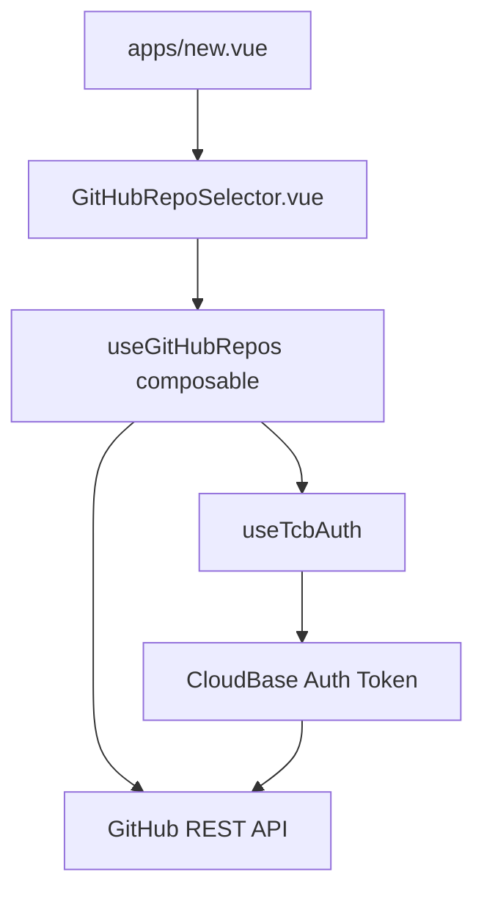

## 用户需求

在创建应用页面（`/app/pages/apps/new.vue`）中，将现有的手动输入GitHub仓库功能升级为智能仓库选择器，允许用户从已有的GitHub仓库列表中选择，而不是手动输入。

## 产品概述

为已登录并绑定GitHub账号的用户提供便捷的仓库选择体验，通过GitHub API获取用户的个人仓库和组织仓库，支持在User和Organization之间切换查看不同的仓库列表。

## 核心功能

- **GitHub仓库列表获取**：通过GitHub API获取用户的个人仓库和所属组织的仓库
- **User/Organization切换**：支持在个人仓库和组织仓库之间切换查看
- **仓库搜索过滤**：支持按仓库名称搜索过滤
- **仓库选择器**：提供下拉选择器或搜索框形式的仓库选择界面
- **兼容现有功能**：保持手动输入功能作为备选方案
- **GitHub绑定状态检测**：未绑定GitHub时提示用户绑定

## 技术栈选择

基于现有项目技术栈：

- **前端框架**：Nuxt 3 + Vue 3 Composition API
- **UI组件库**：Nuxt UI（USelect、UButton、UIcon等）
- **认证系统**：CloudBase Auth（已集成GitHub OAuth）
- **HTTP客户端**：$fetch（Nuxt内置）
- **类型系统**：TypeScript
- **GitHub API**：GitHub REST API v4

## 实现方案

### 高级策略和关键技术决策

采用**渐进式增强**的实现策略，在现有手动输入功能基础上添加智能仓库选择器。通过GitHub REST API获取仓库数据，使用Nuxt UI的USelect组件提供流畅的选择体验。

**关键技术决策：**

1. **API选择**：使用GitHub REST API而非GraphQL，降低复杂度且满足需求
2. **认证方式**：利用CloudBase OAuth获取的GitHub access token
3. **数据缓存**：使用Vue的响应式缓存避免重复请求
4. **错误处理**：优雅降级到手动输入模式
5. **性能优化**：懒加载仓库数据，支持搜索过滤

### 实现细节

**性能优化：**

- 仓库数据懒加载，仅在用户展开选择器时请求
- 实现本地搜索过滤，避免频繁API调用
- 缓存组织列表和仓库数据，减少重复请求
- 分页加载大量仓库，每次加载100个

**错误处理与可靠性：**

- API请求失败时自动降级到手动输入模式
- 显示清晰的错误提示和重试选项
- GitHub未绑定时引导用户绑定
- 网络异常时保持界面可用性

**防爆半径控制：**

- 保持现有手动输入功能完全兼容
- 新功能作为增强特性，不影响核心创建流程
- 使用feature flag模式，便于回滚
- 严格的错误边界，避免影响其他表单字段

## 架构设计

### 系统架构

采用**分层架构**模式：

- **表示层**：Vue组件（GitHubRepoSelector.vue）
- **业务逻辑层**：Composable（useGitHubRepos.ts）
- **数据访问层**：GitHub API客户端
- **缓存层**：Vue响应式缓存

### 组件关系



### 数据流

用户操作（展开选择器）→ 检查GitHub绑定状态 → 获取access token → 调用GitHub API → 缓存仓库数据 → 渲染选择器 → 用户选择仓库 → 更新表单字段

## 目录结构

```
app/
├── composables/
│   └── useGitHubRepos.ts          # [NEW] GitHub仓库管理composable。实现GitHub API调用、仓库数据获取、组织切换、搜索过滤等核心业务逻辑。包含错误处理、缓存机制和性能优化。
├── components/
│   └── GitHubRepoSelector.vue     # [NEW] GitHub仓库选择器组件。提供User/Org切换、仓库搜索、下拉选择等交互功能。集成Nuxt UI组件，支持键盘导航和无障碍访问。
├── types/
│   └── github.ts                  # [NEW] GitHub相关类型定义。定义Repository、Organization、User等接口，确保类型安全和API契约一致性。
└── pages/apps/
    └── new.vue                    # [MODIFY] 创建应用页面。集成GitHubRepoSelector组件，保持现有手动输入功能作为备选方案，优化用户体验流程。
```

## 关键代码结构

### GitHub仓库类型定义

```typescript
// types/github.ts
export interface GitHubRepository {
  id: number
  name: string
  full_name: string
  description: string | null
  private: boolean
  owner: {
    login: string
    type: 'User' | 'Organization'
  }
  html_url: string
  updated_at: string
}

export interface GitHubOrganization {
  id: number
  login: string
  description: string | null
  avatar_url: string
}

export interface RepoSelectorOption {
  value: string
  label: string
  description?: string
  icon?: string
}
```

### GitHub API Composable接口

```typescript
// composables/useGitHubRepos.ts
export interface UseGitHubReposReturn {
  // 状态
  loading: Ref<boolean>
  error: Ref<string | null>
  
  // 数据
  userRepos: Ref<GitHubRepository[]>
  orgRepos: Ref<GitHubRepository[]>
  organizations: Ref<GitHubOrganization[]>
  
  // 方法
  fetchUserRepos(): Promise<void>
  fetchOrgRepos(org: string): Promise<void>
  fetchOrganizations(): Promise<void>
  searchRepos(query: string): GitHubRepository[]
}
```

## Agent Extensions

### MCP

- **fetch**
- 目的：调用GitHub REST API获取仓库和组织数据
- 预期结果：成功获取用户仓库列表、组织列表和组织仓库数据，支持错误处理和重试机制