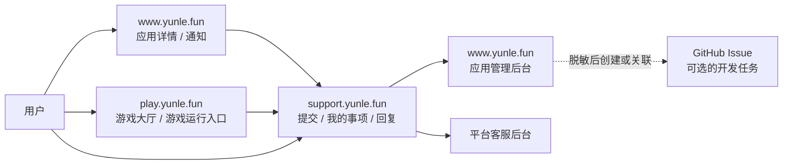

# 应用反馈与平台支持系统规格

> 状态：产品基线已确认，尚未实现
>
> 日期：2026-07-26
>
> 上位决策：[应用反馈与平台支持架构决策](./feedback-support-decision.md)

本文定义第一版应用反馈与平台支持系统的产品边界、权限、安全和数据基线。集合名、接口名和页面路径是实施建议，可在开发前调整；隐私边界、角色隔离和已明确的非目标不得被实现细节弱化。

## 目标

- 让登录用户私密地联系应用开发者，反馈问题和改进建议。
- 为账号、支付、隐私、安全等平台问题提供轻量、可追踪的工单门户。
- 让两类事项复用基础能力，同时保持责任、权限和队列隔离。
- 让应用反馈可以关联 GitHub 开发任务，而不泄漏站内私密内容。
- 优先使用站内通知，降低邮件发送量和邮件回复带来的同步复杂度。

## 术语与事项类型

系统统一称一条可持续回复、具有状态的记录为“事项（case）”。

| 类型               | 用户看到的名称 | 允许的分类                                                     | 处理人                           |
| ------------------ | -------------- | -------------------------------------------------------------- | -------------------------------- |
| `app_feedback`     | 应用反馈       | 异常或缺陷、功能建议、使用问题、兼容性、其他                   | 应用所有者；以后可显式授权维护者 |
| `platform_support` | 平台工单       | 账号与登录、订单与支付、隐私与数据、账号安全、会员与云币、其他 | 获授权的平台客服                 |

分类可以决定后续字段，但不能改变权限。例如“订单与支付”要求用户选择相关订单，“兼容性”可以询问设备和系统版本。

## 产品界面与路由

### 用户侧

- 应用详情页“反馈问题”跳转到 `support.yunle.fun/feedback/new?app={appId}`。
- 支持中心读取登录态并由服务端解析应用；应用不存在或不再接受反馈时，明确告知原因。
- “我的事项”分为“应用反馈”和“平台工单”，避免用户误判处理主体。
- 新建平台工单入口只展示平台负责的私密问题分类。
- 站内通知打开支持中心的事项详情页。

### 处理侧

- 应用所有者在主站应用管理后台查看和回复自己应用的反馈。
- `play.yunle.fun` 只提供反馈入口和通知跳转，不创建另一套处理队列或管理后台。
- 平台客服在独立队列处理平台工单。
- 平台治理视图与平台客服视图分离；治理访问应用反馈必须记录原因和审计事件。
- 共用底层接口不等于共用列表查询，所有查询都必须按角色和资源权限过滤。

### 游戏大厅与游戏接入

`play.yunle.fun` 同时是一个官方一方应用和游戏消费入口，但不能成为所有游戏反馈的代理处理人。

| 用户选择             | 事项类型           | 目标                         | 处理人                         |
| -------------------- | ------------------ | ---------------------------- | ------------------------------ |
| 反馈当前游戏         | `app_feedback`     | 当前游戏的 `targetAppId`     | 该游戏所有者或显式维护者       |
| 反馈游戏大厅         | `app_feedback`     | `targetAppId=play`           | 游戏大厅所有者或显式维护者     |
| 账号、支付、隐私问题 | `platform_support` | 平台                         | 平台客服                       |
| 作弊、骚扰、违规内容 | 未来治理事项       | 游戏、房间、对局或被举报对象 | 平台治理团队，不交给应用所有者 |

接入约束：

- 在 SSO Client Registry 中为大厅注册 `clientId=play-web`，由服务端派生 `appId=play`。
- 每款游戏仍拥有自己的稳定 `appId`，不得因为由大厅启动而改记为 `play`。
- 大厅和游戏内暂停菜单可以复用 `support.yunle.fun/feedback/new?app={targetAppId}&source=play`；`source` 只是导航提示，不能作为可信审计字段。
- 需要可信来源或诊断上下文时，调用 `support-api` 创建短期、不透明的 `feedbackContextId`。服务端从已认证客户端派生来源，并在创建事项时重新解析目标应用、所有权和状态。
- 第一版以 URL 契约复用即可；多个游戏确实出现重复接入代码后，再抽取只负责打开反馈入口的轻量 launcher。它不得读取事项历史、持有处理权限或演变成聊天 SDK。
- 官方游戏和第三方游戏使用同一应用反馈流程。第一版由实际负责人账号作为所有者；需要多人处理时先启用显式维护者授权，不能共享官方账号。

作弊、骚扰、玩家举报和违规内容具有不同的证据、时效、被举报人保密与治理权限要求，不能强行放入应用反馈或普通平台工单。启用多人游戏、玩家互动或 UGC 前，应在同一事项引擎上增加独立的 `trust_safety_report` 类型和治理队列；在此之前不预建完整举报系统。

### 登录与无法登录

- 新建、查看和回复站内事项默认必须登录，并绑定 CloudBase `uid`。
- 不提供匿名事项，也不得用任意邮箱地址模拟登录用户。
- 登录前记住安全的目标路径，完成跨站 SSO 后返回；不得在 URL 中携带 access token 或事项正文。
- 无法登录的用户继续使用[公开联系页](../content/1.docs/contact.md)上的客服邮箱或微信客服。这是由平台支持人员监控的现有人工兜底渠道，不代表接入外部客服 SaaS。
- 账号恢复的人工核验流程不得索要密码、token、完整支付凭证或其他高风险秘密。恢复登录后，由用户新建站内工单；如需关联先前沟通，只保存最小来源引用并再次征得用户确认，绝不自动把未验证邮箱或微信会话绑定到账号。

第一阶段发布前，平台运营必须明确上述渠道的日常责任人、轮值方式和不可用时的替代入口，并从未登录页面实际验证用户可以找到它们。

### 账号安全与漏洞披露

- 个人账号疑似被盗、异常登录或账号恢复问题属于 `platform_support` 的“账号安全”。
- 可影响其他用户或平台系统的认证绕过、越权、注入、密钥泄漏等漏洞属于安全漏洞披露，使用 `security@yunle.fun`。
- 提交页同时展示这一区分；普通客服收到疑似漏洞时只转交安全响应渠道，不把细节复制到应用反馈、GitHub 或普通工单评论。

## 角色与权限

下表描述“某个角色本身带来的权限”。角色可以叠加：例如应用所有者也可以作为普通登录用户提交自己的平台工单，但应用所有者身份不会赋予他查看其他平台工单的权限。

| 操作              | 登录用户/提交者 | 应用所有者   | 显式维护者（未来） | 平台客服 | 平台治理                         |
| ----------------- | --------------- | ------------ | ------------------ | -------- | -------------------------------- |
| 新建应用反馈      | 登录用户可新建  | 无额外权限   | 无额外权限         | 无       | 无                               |
| 查看/回复应用反馈 | 仅自己的事项    | 仅自己的应用 | 仅显式授权后       | 无       | 履行治理职责时可访问，必须审计   |
| 新建平台工单      | 登录用户可新建  | 无额外权限   | 无额外权限         | 第一版无 | 无                               |
| 查看/回复平台工单 | 仅自己的事项    | 无           | 无                 | 授权范围 | 默认无；临时取得支持权限后才可以 |
| 创建 GitHub 关联  | 无              | 仅自己的应用 | 以后可授权         | 无       | 无                               |
| 全局限制用户      | 无              | 无           | 无                 | 按策略   | 是                               |
| 单应用限制用户    | 无              | 仅自己的应用 | 以后可授权         | 无       | 可复核                           |

补充约束：

- 第一版应用反馈处理者只有应用所有者。
- `app_maintainers` 可以作为未来显式授权关系，但第一版不开放配置入口。
- GitHub 仓库成员关系永远不能自动生成站内处理权限。
- 用户失去单应用回复权限后，仍可查看已有事项和最终处理结果。
- 权限变化对后续请求立即生效，不能把创建时的处理人快照当作永久授权。

平台客服和平台治理是不同角色：

- 平台客服权限由平台内部访问控制名单显式授予，至少区分查看、回复、敏感资料查看和管理；授予、变更和撤销都要审计。
- 平台治理默认不能读取平台工单正文，也不能回复。
- 若治理人员处理严重滥用或安全事件时必须读取正文，应通过“紧急访问”临时取得具体事项的支持权限，填写原因和有效期；授权、访问和到期均写入审计。
- 治理人员可以根据不含正文的状态与滥用元数据执行强制关闭；如果判断需要正文，必须先走紧急访问。

## 隐私边界

- 两类事项默认私有，第一版不提供“公开此事项”开关。
- 应用反馈仅对提交者、当前获授权处理者和履职中的平台治理人员可见。
- 平台工单仅对提交者和获授权平台客服可见；平台治理人员只有取得上述临时支持权限后才进入此范围。
- 通知、日志、分析和搜索索引不得把私密正文复制到更宽权限的系统。
- 所有管理访问、强制关闭、转交、限制用户和敏感资料查看均写入不可由普通用户修改的审计事件。

### 账号与订单资料

- 事项保存 `uid` 和业务对象引用，不复制完整账号、钱包、订单或支付记录。
- 用户选择订单时，只保存 `orderId` 和用于展示的脱敏摘要。
- 平台客服按处理需要从权威数据源实时读取，默认掩码展示个人信息。
- 每次敏感资料查看记录查看者、时间、事项、对象和字段范围。
- 应用开发者永远不能通过应用反馈读取上述平台私密资料。

## 状态与回复流程

第一版状态建议统一存储为机器状态，再按事项类型展示用户文案：

| 状态               | 含义                                     |
| ------------------ | ---------------------------------------- |
| `submitted`        | 已提交，尚未由处理人响应                 |
| `waiting_handler`  | 等待开发者或平台客服处理                 |
| `waiting_reporter` | 等待提交者补充信息或确认                 |
| `accepted`         | 已确认处理，但尚未完成；主要用于应用反馈 |
| `resolved`         | 处理人认为已经解决，等待用户确认         |
| `closed`           | 已结束，只允许在规则范围内重新打开       |

规则：

1. 用户创建事项后进入 `submitted`。
2. 处理人首次回复后，根据下一步责任进入 `waiting_handler` 或 `waiting_reporter`。
3. 处理人给出结果时标记 `resolved`。
4. 用户可以确认解决；若说明仍未解决，事项回到 `waiting_handler`，此时尚未关闭，不消耗重新打开次数。
5. `resolved` 后 7 天用户无回应则自动关闭。
6. 自动关闭或确认关闭后的 14 天内允许原提交者重新打开一次，重新打开后进入 `waiting_handler`；超过期限应新建事项并关联旧事项。
7. 无效、重复或滥用事项可直接关闭，但必须选择原因并写入审计事件。
8. 平台治理可以强制关闭或恢复，并必须记录原因。

`accepted` 只用于处理人已经确认会处理但尚未完成的应用反馈。处理人可以把它转为 `waiting_reporter`、`waiting_handler` 或 `resolved`；平台工单第一版不使用该状态。关联旧事项由新事项的提交者发起，处理人只能建议关联或在得到提交者确认后代为关联。

应用反馈不承诺 SLA。平台可以设置内部优先级和安全事件升级规则，但第一版不对外展示响应时限承诺。

## 转交

### 应用反馈转平台工单

当问题实际属于平台账号、支付、隐私或安全：

- 生成一份只包含解决平台问题所需内容的转交摘要，并创建独立的平台工单；
- 平台工单使用新的消息和附件存储对象，绝不跨事项引用应用反馈的附件；
- 原应用反馈进入“已转平台”的只读状态，从转交时刻起通过显式撤权字段拒绝应用处理者继续访问；
- 已转交内容不再显示给应用处理者，但系统无法撤回处理者在转交前已经查看或自行保存的信息，因此提交页必须始终提醒用户不要在应用反馈中填写账号、订单、支付或安全秘密；
- 记录原事项、目标事项、操作者、原因和时间；
- 向用户说明处理主体已经改变。

### 平台工单转应用反馈

平台工单可能含有账号或支付信息，不能直接暴露给第三方开发者。必须：

1. 让用户预览将被发送给开发者的摘要和附件；
2. 把待确认的摘要、附件列表、版本和内容哈希保存为不可变转交快照；
3. 得到用户对该快照的明确确认；执行前服务端再次校验版本和哈希；
4. 新建应用反馈，正文和已确认附件都复制为新的存储对象，不得跨事项引用原工单对象；
5. 原平台工单继续保持对开发者不可见。

## 应用生命周期

- 应用下架后停止接收新反馈，已有反馈可继续处理。
- 应用删除后，已有反馈进入只读或待关闭状态，并保留最小应用快照：`appId`、当时名称、当时所有者 ID；历史所有者 ID 在账号删除时仍须按账号删除规则解除关联或匿名化。
- 所有者账号删除或失去所有权时：
  - 若以后存在显式维护者，转移给仍获授权的维护者；
  - 否则关闭反馈并通知用户该应用已无可用处理人。
- 平台不得因为第三方应用失去维护者而自动承担应用问题的处理责任。

## GitHub Issue 关联

一条应用反馈可以关联一个或多个外部任务，但第一版界面可限制为一个主要 Issue。

支持两种操作：

- 创建新 Issue：开发者编辑标题与公开摘要，确认目标仓库后提交；
- 关联已有 Issue：开发者输入或选择已有 Issue，服务端校验仓库和 Issue 是否存在。

必须满足：

- 站内反馈继续作为来源记录，不能因关联成功而删除或转换；
- 第一版只允许向应用当前配置且由服务端解析出的 GitHub 仓库创建或关联 Issue，不接受客户端指定任意仓库；
- 外发字段采用允许列表：公开标题、公开摘要和明确允许的 labels；不接受 HTML、附件 URL、用户 ID、订单 ID 或内部事项 URL；
- 创建前默认不带用户身份、私密回复、附件和诊断原文，前后端都执行敏感信息检测，后端检测失败时阻止外发；
- 公开摘要必须由开发者预览并确认；
- 保存 provider、repository、issue number、URL、创建人和时间，并在审计事件中保存实际外发的公开标题、摘要、labels 和内容哈希；
- 第一版只做站内到 GitHub 的单向关联，不同步评论和状态；
- 目标仓库权限只决定是否能创建 Issue，不决定谁能查看站内反馈。

现有 `github-api` 只拥有仓库 metadata 读取权限，不能直接创建 Issue。启用创建功能前，必须为 GitHub App 增加目标仓库的 Issues write 权限、让安装者明确重新授权，并由 `support-api` 只把已确认的允许列表字段交给 `github-api`。若没有写权限，系统只允许关联已有 Issue，不能静默改用个人 token 或平台 PAT。

## 附件与诊断信息

### 附件

- 第一版允许 `image/png`、`image/jpeg`、`image/webp` 和 `text/plain`，并同时校验扩展名、声明 MIME 和文件签名。
- 每条回复最多 3 个附件，每个最多 10 MB。
- 第一版禁止 SVG、HTML、PDF、压缩包、可执行文件、脚本包和其他不在允许列表中的格式。
- 文件存入 CloudBase 私有存储；只通过短时签名 URL 提供下载。
- 下载 URL 必须在授权后生成，不能将永久 URL 写入消息正文。
- 附件先进入隔离区，通过类型检测、恶意文件扫描和秘密检测后才能供参与者下载；扫描失败、超时或能力不可用时拒绝附件，不能“先放行后补扫”。
- 图片中的个人信息无法依靠自动检测完全避免，上传前必须提醒用户自行遮挡账号、订单、支付凭证和其他无关信息。
- 事项关闭 90 天后默认删除附件，法律保留除外。

如果第一版上线时不能提供可靠的恶意文件扫描和隔离流程，应先关闭附件功能，只上线纯文本事项。

### 自动采集

默认仅自动附带：

- 目标 `appId`；
- 应用版本；
- 提交时间；
- 来源页面路径，删除 query 和 fragment。

经可信 `feedbackContextId` 可以额外记录由服务端派生的 `sourceClientId`、`sourceSurface` 和大厅版本。推荐的 `sourceSurface` 初始值为 `hall`、`game_detail` 和 `game_runtime`。

以下信息只能在用户预览并确认后提交：

- 浏览器与操作系统版本；
- 错误码；
- 已脱敏的请求 ID；
- 房间号、对局 ID 或回放引用。

不得自动采集控制台输出、网络请求、截图、Cookie、token、支付凭证、玩家列表、聊天记录、回放内容或输入内容。前后端应识别并阻止常见密钥、token、银行卡号等秘密进入正文或附件。

## 通知与邮件

- 所有状态变化和新回复优先写入现有 `user_notifications`。
- 平台工单通知只展示通用提示，不包含分类、标题或正文。
- 应用反馈通知可以展示应用名和反馈标题，不展示回复正文。
- 查看事项后更新该事项通知的已读状态；不能以邮件打开像素作为已读依据。
- 两类事项默认均不发邮件。
- 事项参与者可对单个事项开启邮件提醒；只对“另一位参与者的新回复”发送第一条未读通用提醒，自己的回复和纯状态变化不触发邮件，直至用户重新访问。
- 邮件不含正文或附件，不提供“回复此邮件”入口。
- 账号删除、安全告警和支付交易等事务邮件沿用现有规则，不受事项通知偏好影响。

## 限流与治理

第一版服务端默认限制：

| 限制                       | 默认值 |
| -------------------------- | ------ |
| 单用户、单应用每天新建反馈 | 3      |
| 单用户每天新建应用反馈总数 | 10     |
| 单用户同时打开的平台工单   | 3      |
| 单事项每小时回复数         | 30     |
| 单条回复附件数             | 3      |
| 单附件大小                 | 10 MB  |

限制值放在服务端配置中，便于按实际数据调整。单应用限制和平台全局限制可以覆盖默认值。

应用所有者只能限制用户在自己的应用下新建或回复，不能执行全局封禁。限制必须记录操作者、原因、范围和有效期，并向用户展示不泄漏治理细节的结果。平台治理人员可以复核和撤销。

## 保留与删除

- 打开中的事项保留到处理完成。
- 事项关闭 90 天后删除附件。
- 回复正文在事项关闭一年后物理删除；需要长期统计时只保留不含正文的结构化事件。
- 类型、状态时间、响应时长、解决结果等不含正文的统计元数据可以继续保留。
- 支付争议或安全事件只有在明确法律或安全需要时进入保留状态，并记录原因和到期时间。
- 账号删除时删除身份关联；为防欺诈、财务或审计必须保留的最小记录应匿名化，并遵循现有账号删除政策。
- 清理任务必须幂等、可重试，并产生仅含计数和错误的运维日志，不能把已删除正文写入日志。

具体保留期限在上线前需要由隐私政策和实际合规要求再次确认；若正式政策给出更短期限，以更严格者为准。

## 数据与服务设计建议

### 服务边界

建议新增独立 CloudBase 云函数 `support-api`，不要把事项能力继续堆入 `account-api`：

- `support-api` 负责身份校验、授权、事项状态机、回复、附件签名、限流和审计；
- `account-api` 继续负责账号、订单、钱包等权威业务数据；
- `support-api` 仅在处理平台工单的授权场景下按引用读取必要数据；
- `support.yunle.fun` 和主站只承载 UI，不持有 CloudBase 管理密钥；
- `support-api` 负责生成、校验和审计 GitHub 公开外发数据，现有 `github-api` 在补充 Issues write 权限后负责 GitHub 鉴权与写入；两者都不能读取超出职责所需的私密内容。

### 建议集合

| 集合                          | 用途                     | 关键字段示例                                                                                                         |
| ----------------------------- | ------------------------ | -------------------------------------------------------------------------------------------------------------------- |
| `support_cases`               | 事项主记录               | type、category、reporterId、targetAppId、sourceClientId、sourceSurface、contextRef、status、assigneeScope、retention |
| `support_case_messages`       | 用户与处理人回复         | caseId、authorId、authorRole、body、createdAt                                                                        |
| `support_case_events`         | 不可变审计与状态事件     | caseId、eventType、actorId、reason、createdAt                                                                        |
| `support_case_attachments`    | 私有附件元数据和清理状态 | caseId、messageId、storageKey、mime、size、deleteAfter                                                               |
| `support_case_external_links` | GitHub 等外部任务关联    | caseId、provider、repository、externalId、url                                                                        |
| `app_maintainers`             | 未来的显式应用维护者授权 | appId、userId、role、grantedBy、revokedAt                                                                            |

实现时应补充唯一约束、分页索引和按角色的查询索引。消息和审计事件采用稳定 ID 与幂等键，避免重试导致重复回复或重复状态变化。

### 写入原则

- 客户端不得直接写上述集合；所有写入通过 `support-api`。
- 客户端读取也应经过服务端授权查询，不能依赖宽松数据库规则后在前端过滤。
- 每次写入都校验当前事项版本或合法状态迁移，避免并发覆盖。
- 正文与附件不进入通用应用日志、分析事件或错误上报。

## 指标

仅统计运营所需的结构化数据：

- 新建、打开和关闭数量；
- 首次响应时间和解决时间；
- 解决率和重新打开率；
- 应用反馈关联 GitHub Issue 的比例；
- 限流、附件拒绝和治理操作数量。

不得对私密正文做用户画像、营销分析或无明确目的的内容分析。若以后使用 AI 摘要，应另行说明处理目的、数据范围、保存方式和人工确认边界。

## 上线阶段

完整 MVP 包含以下两个阶段，但允许分阶段发布。每个阶段必须分别通过自己的门禁；第二阶段尚未发布时，不阻塞第一阶段的平台工单，也不能对外宣称已经支持应用反馈。

### 第一阶段：平台工单与用户事项中心

- 支持中心接入跨站 SSO；
- 新建平台工单、回复、状态和“我的事项”；
- 平台客服队列与审计；
- 站内通知；
- 无法登录时的邮箱/微信兜底说明。

### 第二阶段：应用反馈

- 应用详情反馈入口；
- 应用反馈提交和用户回复；
- 应用所有者管理页；
- 应用生命周期与单应用限制；
- GitHub Issue 创建或关联。

两阶段可以共用数据模型，但第一阶段不能通过临时放宽权限来预埋第二阶段。

## 上线前检查

### 两阶段共用门禁

- [ ] 完成威胁建模，覆盖越权读取、ID 枚举、附件泄漏、XSS、CSRF、重复提交和敏感信息外泄。
- [ ] 所有列表、详情、附件签名和管理接口都有服务端权限测试。
- [ ] 配置数据库索引、私有存储规则、限流和幂等键。
- [ ] 实现附件与正文保留清理任务，并验证法律保留到期。
- [ ] 更新隐私政策，说明事项内容、附件、诊断信息、处理者和保留期限。
- [ ] 更新联系与支持说明，明确公开渠道、私密工单、无法登录和漏洞披露入口。
- [ ] 把事项数据纳入账号删除和导出流程。
- [ ] 建立用量、成本、错误率和治理操作监控。
- [ ] 在生产 UI 中明确说明这是异步反馈/工单，不承诺实时在线响应。
- [ ] 附件隔离和扫描可用；否则在该阶段关闭附件功能。

### 第一阶段门禁：平台工单

- [ ] 明确平台客服授权来源、最小权限、撤销和紧急访问流程。
- [ ] 验证通知不泄漏平台工单分类、标题、正文或个人信息。
- [ ] 为无法登录用户发布并监控真实可用的微信客服和客服邮箱入口。
- [ ] 定义账号恢复的人工身份核验流程；不得要求密码、token、完整支付凭证或其他高风险秘密。
- [ ] 验证平台工单转应用反馈只使用用户确认的不可变快照和独立附件对象。

### 第二阶段门禁：应用反馈

- [ ] 验证应用所有权变更、下架、删除和所有者账号删除的处理。
- [ ] 验证应用反馈转平台工单会撤销后续开发者访问，并使用独立副本。
- [ ] 验证 GitHub 外发允许列表、敏感信息拦截、目标仓库限制和审计快照。
- [ ] 若开放创建 Issue，为 GitHub App 增加最小 Issues write 权限并完成安装者重新授权。

## 验收基线

共用基线：

1. 用户只能查看自己的事项，枚举 ID 不会返回资源是否存在的额外信息。
2. 转交、强制关闭、用户限制和敏感资料查看均有审计。
3. 启用附件时，过期 URL 在未授权用户侧无法重新生成。
4. 默认只产生站内通知，不产生普通回复邮件。
5. 关闭、自动关闭、重新打开和保留清理均可重试且不会重复执行。

第一阶段还必须满足：

1. 应用所有者身份不能用于读取平台工单或其订单、账号引用。
2. 平台治理人员未取得临时支持权限时不能读取平台工单正文。
3. 无法登录的用户可以从公开联系页找到受监控的人工兜底渠道。

第二阶段还必须满足：

1. 两个互不授权的应用所有者无法读取彼此应用的任何反馈。
2. 两个方向的转交都不会产生跨权限附件引用。
3. GitHub Issue 创建前必须人工确认允许列表内的公开摘要，失败不会丢失站内反馈。
