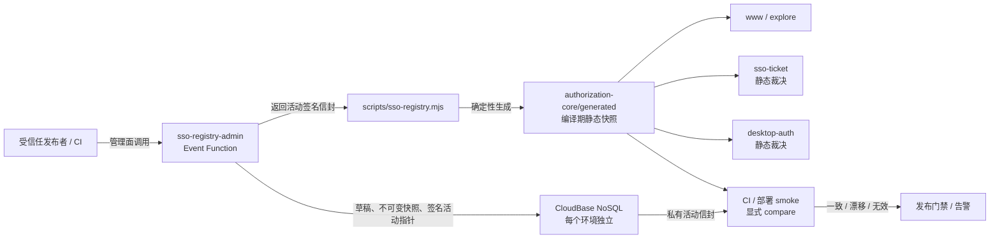

# SSO Client Registry 平台化设计

状态：Confirmed；运行时 shadow 部分由 P1.1 静态发布决策取代（2026-08-04）
对应需求：`requirements.md` R1–R10

## 1. 归属决策

平台化 Registry 的协议实现、数据契约、发布函数、生成工具和运行时适配器全部归属 `www.yunle.fun` 仓库。

原因：

- `www.yunle.fun` 是 SSO Provider，也是 issuer `https://www.yunle.fun` 的所有者。
- `@yunlefun/authorization-core`、`sso-ticket`、`desktop-auth` 和主站应用探索页已经在同一 monorepo 中消费 Registry。
- CloudBase 生产与开发环境已经由该 Provider 的部署清单管理。
- 把安全策略放到 SMAP、FC 等 Consumer 会形成多份真相源。

未来若增加可视化管理页，`admin.yunle.fun` 只作为操作入口调用 Provider 拥有的管理接口；它不复制 Schema、签名逻辑或 Registry 数据。只有出现多个独立 Provider、独立身份平台团队或需要跨组织服务等级时，才考虑把 Registry 拆为独立仓库或服务。

## 2. 总体架构



核心原则：

1. **管理源与裁决源分离**：P1 的管理源是 NoSQL，裁决源仍是编译期静态快照。
2. **发布而非实时配置**：草稿和活动快照不会被授权运行时读取，只有 generated JSON 随部署进入裁决。
3. **同环境读取**：production 与 development 各自在自己的 CloudBase 环境保存 Registry，不跨环境读库。
4. **无请求级数据库依赖**：shadow compare 由 CI、部署 smoke 或独立任务执行，不挂接授权请求。
5. **Consumer 无平台依赖**：Consumer 继续只配置 `clientId`、scope 和精确 callback。

## 3. 模块边界

### 3.1 `packages/authorization-core`

新增纯授权域模块：

- `registry-schema.ts`
  - 严格解析 `ClientRegistrySnapshot` 与发布信封
  - 拒绝未知安全字段、重复 clientId、非法 adapter/scope/URL
- `registry-canonical.ts`
  - 生成确定性 JSON
  - set-like 数组按字典序规范化
  - 分别计算完整 `contentHash` 和只含授权安全字段的 `securityHash`
- `registry-signature.ts`
  - 使用 Ed25519 验证发布快照和活动指针
  - 发布侧签名函数只在 Node 管理函数中使用
- `registry-trust.ts`
  - 保存经过代码评审的 environment -> keyId -> public JWK 信任锚
  - 只在 Registry 签名密钥轮换时修改，不随客户端配置变化
- `generated/production-registry.json`
- `generated/development-registry.json`
  - 保存签名发布信封及其 Registry 内容
  - 由工具生成，不手工编辑

现有 `registry.ts` 调整为解析 generated JSON，并继续导出 `productionRegistry` 与 `developmentRegistry`，从而保持所有调用方 API 不变。

### 3.2 `cloudfunctions/sso-registry-admin`

新增无 HTTP 网关、无客户端调用权限的 Event Function：

- `saveDraft`
- `validateDraft`
- `publishDraft`
- `rollback`
- `getActiveEnvelope`
- `getStatus`

调用边界：

- `aclRule.invoke=false`
- 只允许 CloudBase 管理面、受保护 CI 或人工运维通过 MCP/管理 CLI 调用
- 私钥只存在于本函数环境变量
- 管理请求必须包含非空 operator 与 changeReason；它们是审计标签，真正的信任边界是管理面凭据
- 审计同时记录 CloudBase RequestId，便于与平台操作日志关联

环境变量：

- `SSO_REGISTRY_SIGNING_KEY`：当前环境独立 Ed25519 私钥
- `SSO_REGISTRY_SIGNING_KID`：当前 key id
- `AUTH_ISSUER_ENVIRONMENT`：固定 production 或 development

私钥不得进入生成文件、数据库、日志或返回值。

### 3.3 `scripts/sso-registry.mjs`

提供受控运维命令：

- `validate <file>`：本地严格校验但不写库
- `export --environment <env>`：通过管理面取得活动信封，验证签名后生成 JSON
- `compare --environment <env>`：比较活动信封、generated 文件和静态导出
- `seed --environment <env>`：仅首次迁移时从现有静态 Registry 创建草稿

草稿保存、发布和回滚仍由 `sso-registry-admin` 完成；脚本不直接持有数据库管理员密钥或签名私钥。

### 3.4 授权函数适配

`sso-ticket` 与 `desktop-auth` 只把 `productionRegistry` / `developmentRegistry` 传给 `createAuthorizationCore`。它们不携带 CloudBase shadow store adapter，不读取活动指针或快照；签名信封的读取、验证与比较由 `scripts/sso-registry.mjs compare` 在授权请求之外完成。

## 4. NoSQL 数据设计

每个 CloudBase 环境使用同名集合，数据不跨环境复制。

### 4.1 `sso_registry_drafts`

```ts
interface RegistryDraftDocument {
  _id: string
  environment: 'production' | 'development'
  baseSnapshotId: string | null
  status: 'draft' | 'published' | 'abandoned'
  registry: ClientRegistrySnapshot
  validation: {
    valid: boolean
    errors: string[]
    checkedAt: number
  }
  changeReason: string
  createdBy: string
  createdAt: number
  updatedBy: string
  updatedAt: number
  publishedSnapshotId?: string
}
```

索引：

- `environment + status + updatedAt DESC`

### 4.2 `sso_registry_snapshots`

```ts
interface RegistrySnapshotDocument {
  _id: string
  environment: 'production' | 'development'
  snapshotId: string
  sequence: number
  schemaVersion: 1
  policyVersion: string
  registry: ClientRegistrySnapshot
  canonicalJson: string
  contentHash: string
  securityHash: string
  signature: string
  keyId: string
  sourceDraftId: string
  changeReason: string
  publishedBy: string
  publishedAt: number
}
```

索引：

- `environment + sequence DESC`，唯一
- `environment + policyVersion + publishedAt DESC`
- `environment + contentHash`

文档一经写入不得更新。

### 4.3 `sso_registry_state`

每个环境只有一条活动状态文档，`_id` 固定为环境名：

```ts
interface RegistryStateDocument {
  _id: 'production' | 'development'
  environment: 'production' | 'development'
  generation: number
  activeSnapshotId: string
  action: 'publish' | 'rollback'
  previousSnapshotId: string | null
  activatedBy: string
  activatedAt: number
  activationKeyId: string
  activationSignature: string
}
```

活动签名覆盖 environment、generation、activeSnapshotId、action、previousSnapshotId 和 activatedAt，防止数据库中活动指针被静默篡改。

### 4.4 `sso_registry_audit_logs`

```ts
interface RegistryAuditDocument {
  _id: string
  environment: 'production' | 'development'
  action: 'draft_saved' | 'publish_succeeded' | 'publish_rejected' | 'rollback'
  operator: string
  reason: string
  draftId?: string
  snapshotId?: string
  previousSnapshotId?: string
  requestId: string
  createdAt: number
  details: Record<string, string | number | boolean | null>
}
```

索引：

- `environment + createdAt DESC`
- `environment + operator + createdAt DESC`

所有集合均设置为 **ADMINONLY / server-only**；浏览器 SDK 无直接读写权限。

## 5. 规范化、哈希与签名

### 5.1 规范化

规范化规则：

- 对象键按 Unicode code point 排序
- clients 按 clientId 排序
- adapters 按 kind 排序
- allowedScopes、origins、redirectUris 去重后排序
- URL 必须解析后与输入完全一致，禁止隐式修正主机、路径或尾斜杠
- 不修改 displayName 或 iconUrl 文案

`contentHash` 覆盖完整 Registry；`securityHash` 只覆盖 issuer、clientId、appId、status、adapter、consent、scope、Origin 和 redirect URI。展示名称、图标与原数组顺序不会改变 securityHash。

### 5.2 快照签名

使用独立 Ed25519 密钥对：

```text
signature = Ed25519.sign(
  "yunlefun:sso-registry:snapshot:v1\n" + canonicalJson
)
```

禁止复用身份断言、desktop entitlement 或 custom ticket 的签名密钥。

签名公钥作为非秘密信任锚进入 `authorization-core/registry-trust.ts`。导出、compare 和普通
PR CI 只信任该目录中已经代码评审的 keyId；数据库返回的公钥不得建立信任。密钥轮换
需要先提交新公钥、发布验证方，再切换管理函数私钥，最后在观察窗口后移除旧公钥。

### 5.3 活动指针签名

```text
activationSignature = Ed25519.sign(
  "yunlefun:sso-registry:activation:v1\n" + canonicalActivationJson
)
```

generated 信封记录导出时的 `generation`，导出和 compare 拒绝低于编译期 minimumGeneration 的活动指针。合法回滚会创建更高 generation 的新活动指针，因此不会被误判为重放。

## 6. 发布事务

### 6.1 发布

1. 读取草稿和当前活动状态。
2. 校验草稿的 baseSnapshotId 仍等于当前活动快照，避免覆盖并行发布。
3. 严格校验并规范化 Registry。
4. 计算 contentHash/securityHash。
5. 在管理函数内生成快照签名和新活动指针签名。
6. 在 NoSQL 事务中：
   - 确认状态未变化
   - 写入新不可变快照
   - generation 加一并切换活动指针
   - 把草稿标记为 published
   - 写入审计事件
7. 返回不含私钥的签名活动信封。

相同 draftId 的重试必须幂等：已发布时返回原 snapshotId，不创建第二个快照。

### 6.2 回滚

1. 读取目标历史快照并重新验证其快照签名。
2. generation 加一。
3. 创建 action=rollback 的新签名活动指针。
4. 原子更新状态并写入审计事件。
5. 不修改目标历史快照，也不伪造新的 policyVersion。

## 7. Shadow compare

`scripts/sso-registry.mjs compare --environment <environment>` 通过私有 `getActiveEnvelope` 读取活动信封，在代码信任锚下验证 Schema、签名、environment、issuer 和 generation，再与仓库 generated JSON 做字节级比较。

该命令由受保护 CI、部署 smoke 或独立受控监控任务执行。成功记录 match；漂移、不可用、签名错误或重放使发布门禁失败或触发告警。日志只记录 environment、snapshotId、generation、policyVersion、哈希和错误码，不记录完整 Registry、签名或任何密钥。

## 8. 权限与威胁模型

| 威胁                   | 防护                                              |
| ---------------------- | ------------------------------------------------- |
| 普通用户读写 Registry  | 四个集合 ADMINONLY，发布函数无客户端调用权限      |
| 数据库文档被直接篡改   | 快照与活动指针分别签名，compare 使用独立公钥验证  |
| 旧快照重放             | 签名 generation + 编译期 minimumGeneration        |
| 并行发布覆盖           | baseSnapshotId 乐观锁 + NoSQL 事务                |
| 发布函数私钥泄露       | 独立密钥、只存函数 env、日志与响应禁止输出        |
| 数据库或网络故障       | 当前静态授权不受影响，compare 阻止发布或告警      |
| 主站与云函数白名单漂移 | 同一 generated JSON、构建 vendoring 和 CI compare |
| Consumer 伪造业务归属  | appId 继续只由 Registry 从 clientId 派生          |

## 9. CI/CD 与迁移

### 9.1 CI

普通 PR CI：

- 校验 generated JSON Schema、contentHash、securityHash 和签名
- 确认 `registry.ts` 只消费 generated 文件
- 对所有当前客户端重放授权与 registration fingerprint 测试
- 确认云函数构建产物 vendoring 同一 generated 文件

受保护发布检查：

- 通过管理面读取目标环境活动信封
- 与仓库 generated 文件逐字节比较
- 不一致时阻止 Provider 与授权函数发布

### 9.2 首次迁移

每个环境分别执行：

1. 创建四个集合、索引和 ADMINONLY 权限。
2. 生成独立 Registry Ed25519 密钥对并部署管理函数私钥。
3. 把公钥加入 `authorization-core` 的环境信任锚并先发布验证方。
4. 从当前静态 Registry 创建首个草稿。
5. 发布首个签名快照。
6. 导出 generated JSON，验证所有 registration fingerprint 不变。
7. 发布主站与两个授权函数，并在部署 smoke 中显式执行 compare。
8. 验证 match、数据库不可用、签名错误和活动指针重放均只影响发布门禁或告警。

production 与 development 独立执行，不把 production 私钥、快照或活动状态复制到 development。

## 10. 备选方案与取舍

### 直接让授权请求查询数据库

拒绝。它把数据库可用性和短暂配置漂移引入登录关键路径。

### 把 Registry 完全放在 `admin.yunle.fun`

拒绝。Admin 是控制面 UI，不是 issuer 或授权协议所有者；这样会让 Provider 依赖另一个产品仓库定义安全语义。

### 新建独立 Registry 仓库/服务

暂缓。当前只有一个 Provider 和一个 CloudBase 租户，拆分会增加发布、密钥和可用性成本。模块边界已经为未来迁出保留。

### 只把 Registry 保存成仓库 JSON

不足。它能减少手写 TypeScript，但仍不能提供草稿、活动指针、审计和无需改代码的启停能力。

### P1 立即切换动态裁决

拒绝。先通过独立 compare 验证数据、签名、故障与回滚，再单独评审切换。

## 11. 测试策略

- Schema 属性测试：重复、未知字段、非法 URL、非法 adapter/scope
- 规范化测试：输入顺序不同但 hash 相同
- 签名测试：正确、错误 key、内容篡改、错误 domain separator
- 发布事务测试：幂等、并发 base 冲突、事务回滚
- 回滚测试：generation 递增、历史快照不变
- compare 测试：match、展示漂移、安全漂移、签名错误、重放和管理面不可用
- 兼容性测试：所有现有 production/development 客户端授权结果和 fingerprint 不变
- 构建测试：主站、`sso-ticket`、`desktop-auth` 使用同一 generated 信封
- 生产 smoke：显式 compare 成功且授权请求不读取 Registry 管理数据库

## 12. 上线与回退

上线顺序：

1. 资源和权限
2. `sso-registry-admin`
3. 首次签名快照与 generated 文件
4. 主站
5. `sso-ticket`、`desktop-auth` 静态产物
6. 生产 compare smoke 与观察

P1 回退使用最后已验证的 generated JSON 对应提交或产物；静态 Registry 始终存在，管理数据库故障不需要改授权函数即可维持现有行为。管理数据保留供修复后继续使用。
