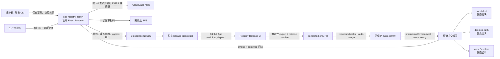

# SSO Client Registry 静态发布自动化设计

状态：Confirmed（2026-08-04）

实现状态：控制面、签名 release intent、dispatcher 与 GitHub CI 已落地；development rollout 待完成

对应需求：`requirements.md` R1–R11

前置设计：`../sso-client-registry-platform/design.md`

## 1. 设计结论

P1.1 采用“CloudBase 控制面 + 邮件第二通道审批 + 签名发布意图 + GitHub 受保护 CI + generated 静态裁决”的发布模型。

授权运行时不新增数据库依赖。production 审批只批准特定 Registry 内容和特定仓库基线；CI 必须从签名快照自行导出 JSON，经 PR required checks 与准确提交部署后，线上静态 Registry 才发生变化。

动态运行时 P2 延期。现有 generated JSON 不被远程 JSON 取代，主站探索页也继续随静态构建更新。

## 2. 总体流程



控制面“已批准”不表示数据面“已部署”。唯一线上裁决源始终是每个消费者当前部署携带的 generated JSON。

## 3. 状态模型

`sso_registry_release_intents` 使用以下状态：

```text
approved
  -> dispatched
  -> pr_open
  -> merged
  -> deploying
  -> deployed
```

终止/可恢复状态：

- `superseded`：默认分支不再等于审批绑定的 baseCommitSha，必须针对新 baseCommitSha 重新审批；仅当原快照仍是当前活动快照且所有策略证据完全一致时可复用原 generation。
- `ci_failed`：生成、diff guard 或 required checks 失败；修复后从同一 intent 幂等重试，内容变化则新建审批。
- `deployment_failed`：部分或全部消费者部署失败；从相同 merge commit 重试或创建 rollback intent。
- `canceled`：审批者或受信任运维在部署前显式取消。

每次状态推进使用 compare-and-set 和幂等键；外部 GitHub/部署调用不放进 NoSQL 事务。

## 4. 管理函数边界

### 4.1 Actions

现有 `sso-registry-admin` 保持无 HTTP 网关、`aclRule.invoke=false`，新增或调整：

- `getDraftDiff`
- `requestPublishApproval`
- `approveAndQueueRelease`
- `getReleaseIntent`
- `recordCiProgress`
- `recordDeploymentResult`
- `requestRollbackApproval`

production 禁用现有无审批 `publishDraft`；development 可保留，但统一复用快照和审计内核。

`recordCiProgress` 与 `recordDeploymentResult` 只接受专用 CI 身份，不能仅依赖 operator 字符串。所有 action 继续记录 CloudBase RequestId。

### 4.2 邮箱解析

配置：

```text
SSO_REGISTRY_APPROVER_UIDS=<immutable uid JSON array>
SSO_REGISTRY_APPROVAL_PEPPER=<independent 32+ byte secret>
SES_TEMPLATE_REGISTRY_APPROVAL=<approved template id>
```

部署准备阶段通过管理面把 `YunYouJun` 唯一映射为 CloudBase Auth uid，并人工核对当前邮箱。运行时每次按 uid 查询 Auth：

- 返回用户数必须恰好为 1，返回 uid 必须匹配请求 uid。
- 用户必须为 ACTIVE，邮箱格式必须合法。
- CloudBase 当前管理端用户契约不提供 `EmailVerified`；不自建或信任用户可写的“已验证”布尔字段。
- 管理 API 查询缺失、重复、uid 不匹配、非 ACTIVE、邮箱非法或查询异常时失败关闭。
- 管理 API 返回的邮箱只用于选择收件地址；审批邮件中的一次性验证码独立确认本次操作的邮箱控制权。
- 完整邮箱只进入 SES Destination 的瞬时内存。
- 持久化 `recipientHash` 与脱敏值，不持久化完整邮箱。

现有 `account-lifecycle-notifier` 的 SES 发送和状态解析逻辑应抽取为可测试共享模块；Registry 审批在共享解析器上额外启用 uid 精确匹配与 ACTIVE 状态检查。

### 4.3 审批码

使用 12 位去歧义大写字母数字随机码：字符表为 `23456789ABCDEFGHJKMNPQRSTVWXYZ`，排除容易混淆的
`0/1/I/L/O/U`，共 30 个候选字符，约 59-bit 熵。每一位必须通过密码学安全的无偏差整数采样产生：

```text
codeMac = HMAC-SHA256(approvalPepper, approvalId + "\0" + normalizedCode)
```

- 30 分钟到期、最多 5 次失败、timing-safe compare。
- 邮件只含 environment、policyVersion、client/security/display diff 摘要、hash 短指纹、请求者、原因、到期时间和审批码。
- 邮件不提供批准 URL；CLI/管理面必须同时提交 approvalId 与 code。
- code、完整邮箱和签名正文不进入日志或响应。

同一草稿同时只允许一个可消费 production approval；新请求会取消旧 pending approval。

## 5. 数据模型增量

### 5.1 `sso_registry_publish_approvals`

```ts
interface RegistryPublishApprovalDocument {
  _id: string
  environment: 'production'
  draftId: string
  baseSnapshotId: string | null
  baseGeneration: number
  baseCommitSha: string
  policyVersion: string
  contentHash: string
  securityHash: string
  diffSummary: RegistryDiffSummary
  requester: string
  requestId: string
  changeReason: string
  approverUid: string
  recipientHash: string
  recipientMasked: string
  codeMac: string
  attempts: number
  maxAttempts: 5
  status:
    | 'delivery_pending'
    | 'pending'
    | 'consumed'
    | 'expired'
    | 'locked'
    | 'delivery_failed'
    | 'canceled'
  expiresAt: number
  createdAt: number
  consumedAt?: number
  releaseIntentId?: string
}
```

索引：

- `environment + status + expiresAt`
- `draftId + createdAt DESC`
- `approverUid + createdAt DESC`

### 5.2 `sso_registry_release_intents`

```ts
interface RegistryReleaseIntentDocument {
  _id: string
  environment: 'production' | 'development'
  approvalId: string | null
  snapshotId: string
  generation: number
  policyVersion: string
  contentHash: string
  securityHash: string
  baseCommitSha: string
  status: ReleaseIntentStatus
  manifestKeyId: string
  manifestSignature: string
  dispatchAttempts: number
  githubRunId?: string
  pullRequestNumber?: number
  mergeCommitSha?: string
  deployedConsumers?: Record<string, string>
  failureCode?: string
  createdAt: number
  updatedAt: number
  deployedAt?: number
}
```

发布意图签名 domain：

```text
yunlefun:sso-registry:release-intent:v1\n
```

签名覆盖 environment、approvalId、snapshotId、generation、policyVersion、contentHash、securityHash 和 baseCommitSha。运行状态、GitHub run/PR/commit 与部署回执不进入不可变签名正文，而由状态机审计记录保护。

### 5.3 `sso_registry_release_outbox`

每个 releaseIntent 一条 outbox，记录 `pending/sent/dead_letter`、attempt、nextAttemptAt 和最后错误码。dispatcher 使用租约锁认领，指数退避并以 releaseIntentId 作为外部幂等键。

新增集合全部 ADMINONLY。实际资源创建、索引和权限变更必须在实施阶段先走 Change Safety 与 Deployment Gate。

## 6. 审批事务

### 6.1 请求审批

1. 重读草稿和当前活动快照。
2. 严格校验并计算完整 security/display diff。
3. 接收维护者 CLI 当前 checkout 的 baseCommitSha，校验格式并绑定到审批；CI 后续必须对受保护默认分支做权威一致性校验。
4. 按 allowlisted uid 查询用户，并通过显式验证标记或 EMAIL 身份源反查确认邮箱。
5. 创建不可消费的 delivery_pending approval 后发送 SES。
6. SES 成功后转为 pending；失败则标记 delivery_failed，不能进入批准事务。

对已发布但 release intent 进入 `superseded` 的草稿，重新请求审批必须确认 draft 指向原 intent、原 intent 的 snapshot/generation 仍与当前活动状态一致，且 policyVersion、clientCount、contentHash 与 securityHash 均未改变。审批记录额外绑定该 superseded intent，防止并发重试串扰。

邮件发送是事务外副作用；记录先以不可消费的 `delivery_pending` 创建，只有 SES 返回 MessageId 后才转为 `pending`，避免事务回滚后邮件中的码仍可被使用。

### 6.2 批准并排队

单一 NoSQL 事务内：

1. 重读 approval、draft 与 current state。
2. 校验 status、expiry、attempt、code MAC、base、hash 与 baseCommitSha。
3. 普通发布创建 P1 不可变快照和递增 generation 的签名 state；rollback 选择历史快照但仍创建新的 generation；对等值的 superseded 重审批则复用当前 snapshot/generation，不重复发布状态。
4. 消费 approval。
5. 创建签名 release intent、outbox 和审计。

相同 approvalId 的成功重试返回原 releaseIntentId。事务成功后 dispatcher 才能触发 GitHub；GitHub 不可用不会破坏审批与快照原子性。

## 7. GitHub Dispatch 与发布 PR

新增私有 `sso-registry-release-dispatcher` Event Function/定时重试器。它使用仅安装到 `YunLeFun/www.yunle.fun` 的 GitHub App installation token 调用 `workflow_dispatch`，输入只包含 releaseIntentId。

GitHub App 不使用个人 PAT，权限限制为实际需要的 Actions、Contents 与 Pull requests 写权限；dispatcher 自身只需 Actions dispatch 能力，PR bot 凭据放在受保护 GitHub Environment 中。实现时以 GitHub 官方 endpoint 权限响应为准，不扩展到组织或其他仓库。

`.github/workflows/registry-release.yml`：

1. 使用 production concurrency，禁止同时处理两个 release intent。
2. 通过专用 CI 身份读取 intent/envelope，并在本地公钥下验签。
3. 检出 baseCommitSha，确认远端默认分支未前移。
4. 运行 `sso-registry export`，生成：
   - `packages/authorization-core/src/generated/<environment>-registry.json`
   - `packages/authorization-core/src/generated/<environment>-release.json`
5. diff guard 只允许上述目标文件变化；禁止 workflow、脚本、源代码或其他配置混入。
6. 运行 Registry 定向测试及全量 lint、typecheck、test、build。
7. 使用短生命周期 GitHub App installation token 创建 `registry/release-<generation>` PR。
8. PR 标注 releaseIntentId、snapshotId、hash 与 diff 摘要，并开启 auto-merge。

PR commit 使用 Conventional Commit：

```text
chore(sso-registry): publish production policy <policyVersion>
```

required checks 在新 PR commit 上运行；不能把 dispatch workflow 在旧 base SHA 上的检查冒充 PR required checks。

## 8. Production 部署

新增 `.github/workflows/registry-deploy.yml`，只响应默认分支上由合法 release manifest 标识的 generated 变更，并引用 GitHub `production` Environment。

部署前：

- checkout mergeCommitSha，不使用浮动 main。
- 在取得 production secrets 前，使用仓库公钥重新验签 release manifest、快照和活动指针，并校验 commit 与允许文件范围。
- GitHub Environment gate 通过并取得专用 secrets 后查询 releaseIntent，要求 approval、intent 和 mergeCommitSha 精确匹配。
- 构建一次，记录主站与云函数 artifact hash。
- 使用单一 `sso-registry-production` concurrency group，不取消正在执行的 production 部署。

部署顺序由 diff 分类：

1. 先部署直接受 security diff 影响的授权函数。
2. 再部署另一授权函数，使所有消费者收敛到同一 generation。
3. 最后部署主站静态构建/探索页。
4. 运行 Web SSO、desktop start/refresh 与探索页 smoke。
5. 只有全部成功才调用 `recordDeploymentResult(status=deployed)`。

静态多消费者部署无法实现分布式原子切换。任何部分失败必须记录每个消费者实际 commitSha，停止宣称 deployed，告警并从相同 merge commit 重试。涉及 redirect URI/Origin 的破坏性变更采用“先增加、迁移 Consumer、再删除”的两阶段 Registry 发布。

GitHub production Environment 只向部署 job 暴露 CloudBase 凭据，且只允许受保护默认分支。凭据优先使用短期身份；若当前平台只能使用静态凭据，则必须为专用、最小权限、可轮换凭据，不复用个人或全局管理员密钥。

实际部署前必须再次执行 CloudBase Deployment Gate，包括环境 ID、函数权限、hosting headers、production secrets、回退 commit 和 smoke 清单确认。

## 9. Shadow compare、回滚与应急

### 9.1 Shadow compare

`scripts/sso-registry.mjs compare` 通过私有管理函数取得已签名活动信封，在本地信任锚下验签，并与仓库 generated JSON 做字节级比较。它只在 CI、部署 smoke 或独立受控监控任务中运行：

- 已批准但未部署：`registry_shadow_pending_release`
- 意图 deployed 且仍漂移：`registry_shadow_security_drift` 高优先级
- deployed 且一致：`registry_shadow_match`

授权函数不打包 shadow adapter、不读取 Registry 管理集合，也不等待 compare；compare 故障只阻止发布或触发告警，不影响当前授权。

### 9.2 常规回滚

从历史签名快照生成 rollback draft/diff，production 仍发送邮件审批。批准后创建更高 generation 的 release intent，CI 生成对应静态 JSON 并走相同 PR、检查、部署和 smoke。

### 9.3 Break-glass

部署系统不可用且安全/可用性要求立即恢复时，可从最后 deployed 的 exact merge commit 和已保存 artifact 重部署。操作必须显式提供 operator/reason，写 CloudBase 与 GitHub deployment audit，并触发高优先级告警。

break-glass 不创建或篡改历史快照，不从数据库动态改变授权，也不能绕过产物签名验证。

## 10. 性能与成本

授权热路径与 P1 相同：

- 实例初始化解析约 6.9 KiB generated JSON 并构建 Map/Set。
- 普通 client、Origin 与 fingerprint 查询为 O(1)。
- 无 Registry 数据库、邮件或 CI 网络请求。

新增成本只在 Registry 变更时产生：一次 Auth 查询、SES 邮件、少量 NoSQL 事务、GitHub workflow 和实际部署。dispatcher 定时空轮询应采用合理周期并批量处理 outbox；低频场景也可由批准事务后最佳努力触发、定时器只负责补偿。

## 11. 安全与失败模式

| 风险                       | 约束                                                 |
| -------------------------- | ---------------------------------------------------- |
| 请求者指定自己的审批邮箱   | 只按 immutable uid allowlist 从 Auth 解析            |
| 邮件扫描器自动批准         | 不提供批准 GET URL，必须提交一次性码与管理凭据       |
| 数据库泄露后猜码           | 约 60-bit 随机码、pepper HMAC、5 次上限、30 分钟     |
| 事务成功但 GitHub 调用失败 | transactional outbox + 有界幂等重试                  |
| 伪造 dispatch payload      | CI 只信 releaseIntentId，并重新读取/验签             |
| 审批后 main 前移           | baseCommitSha 不一致即 superseded、重新审批          |
| Bot 混入代码修改           | generated-only diff guard + PR required checks       |
| 未批准 Registry 被部署     | signed release manifest + intent/commitSha 双重匹配  |
| 部分消费者部署成功         | per-consumer commit 回执、停止 deployed、同 SHA 重试 |
| 回滚重放旧 generation      | 历史 snapshot + 新 generation release intent         |
| 管理数据库不可用           | 已部署静态 Registry 不受影响                         |
| CI/邮件不可用              | 阻止新变更，不影响现有授权                           |

## 12. 测试策略

- Approval：严格 uid/email、码 MAC、过期、5 次锁定、发送失败、草稿/base/commit/hash 变化。
- Transaction：审批消费、快照、state、intent、outbox 与审计原子性、幂等重试。
- Dispatcher：租约锁、退避、重复 dispatch、dead letter、GitHub 错误脱敏。
- CI：伪造 intent、错误签名、stale base、generated-only diff guard、确定性 export。
- PR：新 commit required checks、auto-merge 条件和 Conventional Commit。
- Deploy：manifest/intent/commitSha 不一致、环境 secrets 边界、concurrency、部分失败与同 SHA 重试。
- Compatibility：所有现有授权决定、registration fingerprint 与主站公开配置不变。
- Shadow compare：pending_release、match、deployed drift、数据库/签名故障只阻止发布或告警。
- Rollback：历史快照、新 generation、邮件审批、PR、部署回执与 break-glass 审计。
- 全量 lint、typecheck、test、build、CloudBase code review 和 development smoke。

## 13. 分阶段实施

1. 先完成纯内核 diff、approval、release intent 和 outbox 测试，不接真实 SES/GitHub。
2. development 创建集合/索引与私有函数，使用测试收件人完成邮件 acceptance。
3. 接入 GitHub App 和 registry-release PR 流程，只生成 development 产物，不部署 production。
4. 接入 development 精确提交部署、回执、部分失败和 rollback 演练。
5. production 配置 approver uid、SES 模板、GitHub Environment、secrets、branch protection 和 concurrency。
6. 完成 Deployment Gate 后，以“与当前 generated JSON 完全一致”的无语义变更做 production 首次演练。
7. 演练成功后关闭 production 无审批 publishDraft，并启用正式静态发布流水线。

## 14. 需要确认的设计取舍

1. generated 静态 JSON 永久作为唯一生产裁决源；普通变更仍需要自动部署。
2. production 邮件审批是单管理员第二通道确认，不声称实现双人职责分离。
3. 审批绑定 baseCommitSha；main 前移即 superseded 并重新审批，以避免部署未在审批基线内的代码。
4. CI 通过 generated-only PR、required checks 和 auto-merge落库，不直接向 main 写入。
5. 通过单仓库 GitHub App 驱动 workflow，不使用个人 PAT。
6. production 部署只能使用准确 merge commit，并在全部消费者 smoke 后标记 deployed。
7. 多消费者部署接受短暂非原子窗口；破坏性 Origin/redirect 变更必须两阶段发布。
8. 主站探索页继续静态生成，不建设公开动态 Registry API。
