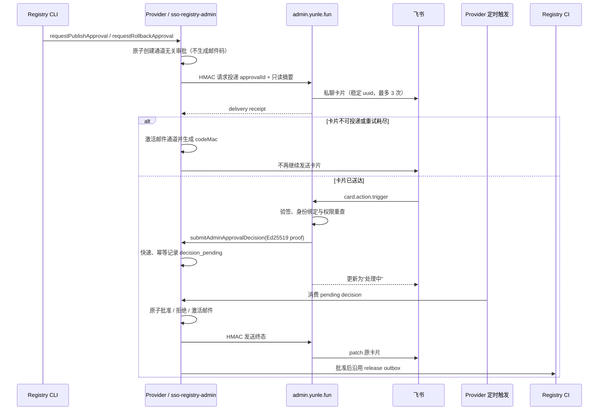

# SSO Client Registry 飞书审批技术设计

状态：Confirmed（2026-09-04）

对应需求：`./requirements.md`

## 1. 设计结论

本阶段只增加两个业务模块：

1. **Admin 飞书身份与审批交互模块**：关联身份、发送和更新卡片、验证回调、重查权限、签发短时证明。
2. **Provider Registry 审批通道适配**：创建通道无关的审批、接收证明、异步消费决定、邮件降级和原子发布。

不新增通用审批平台，不移动 Registry 数据，不让 Admin 直接写 Registry 集合。现有 CLI、静态 generated JSON、release intent、CI outbox 和部署流程保持原有边界。

现有能力直接复用：

- Admin 已有 `@larksuiteoapi/node-sdk`、飞书私聊发送代码、CloudBase 服务端 SDK、YunLeFun SSO 和 GitHub step-up。
- Provider 已有 production 审批记录、邮件验证码、不可变快照、release intent/outbox、定时器和 Ed25519 Admin proof verifier。
- 飞书 Node SDK 提供 authorization-code token 交换、`authen.userInfo`、消息发送 `uuid`、卡片回调验签和消息卡片更新能力。

## 2. UI Design Specification

1. **Purpose Statement**：管理员在同一处查看飞书连接状态并完成安全关联；审批详情页只用于核对证据和主动切换邮件，不复制 Registry 编辑能力。桌面端强调证据层级，移动端保证单手阅读和安全操作不被截断。
2. **Aesthetic Direction**：Industrial / utilitarian，延续现有 Admin 控制台的信息密度、直角层级和克制状态色。
3. **Color Palette**：品牌操作色 `#0052D9`、浅品牌底色 `#F2F3FF`、成功 `#2BA471`、警告 `#E37318`、危险 `#D54941`；全部通过现有 TDesign token 使用。
4. **Typography**：继承项目既有中文管理后台字体栈，以 `PingFang SC` / `Microsoft YaHei` 为主要中文字体，哈希和 ID 使用既有等宽 token。为保持全站一致，本功能不单独引入字体；这是对通用 UI skill 字体建议的项目设计系统覆盖。
5. **Layout Strategy**：桌面使用不对称 5/7 双栏，左侧为连接状态和动作，右侧为安全说明或审批证据；移动端折叠为单列，危险动作独占整行。禁止新增全局顶级导航或居中营销式卡片。

页面范围：

- `/settings` 新增“账号连接”入口。
- `/settings/connections` 展示当前账号的飞书绑定与关联、换绑、解绑动作。
- `/sso-registry/approvals/:approvalId` 展示只读审批证据、通道状态和“切换到邮件”；批准与拒绝仍以飞书私聊卡片为主。

桌面与移动端共享相同权限和事务语义，只调整布局。所有服务端字符串使用 Vue 文本插值；不使用 `v-html`。图标继续使用项目已有 Remix Icon/Iconify 集合，不引入 emoji。

## 3. 总体流程



异步边界只覆盖“用户决定 → 权威事务”。飞书回调在完成验签和 Provider 的快速持久化后即返回；真正的发布、拒绝或邮件切换由 Provider 定时触发消费。若 Provider 暂时不可用，飞书回调返回可重试失败，已验证操作不会被当成成功。

## 4. Admin 模块

### 4.1 飞书 OAuth 关联

关联流程运行在 Web 服务端，不启用或修改 CloudBase 登录 Provider：

1. 已登录管理员在 `/settings/connections` 发起关联、换绑或解绑。
2. 复用现有 GitHub numeric ID step-up；把 reward 专用实现抽成通用 `admin-step-up`，原 reward API 保留兼容 wrapper 和现有集合，不迁移历史 grant。
3. 关联/换绑生成一次性 OAuth state 与 PKCE verifier，保存到加密 session；callback 严格校验 state、时限和预期 Admin uid。
4. 使用飞书 authorization code 换取短时 user access token，再调用 `authen.userInfo` 取得 `tenant_key`、`open_id`、可选 `union_id` 和展示名。
5. 只接受配置的 tenant key；在事务内更新唯一绑定。
6. user access token、refresh token、手机号、邮箱和头像不写入数据库或日志。

解绑只删除当前活动映射，并追加安全审计；历史审计不删除。

### 4.2 数据模型

新增两个 server-only 集合：

`admin_identity_bindings`

```ts
interface AdminIdentityBinding {
  _id: string
  provider: 'feishu'
  kind: 'admin' | 'external'
  adminUid: string
  tenantKey: string
  openId: string
  unionId?: string
  displayName?: string
  counterpartId: string
  createdAt: number
  updatedAt: number
}
```

同一关联在事务内写两条确定性映射：Admin uid → external identity，以及 tenant/open id → Admin uid。两条 `_id` 均由带域分隔的 SHA-256 生成，不暴露原始身份；因此无需依赖稀疏唯一索引，也不会出现双向绑定竞态。解绑事务同时删除两条活动映射。

`admin_identity_audit_logs`

```ts
interface AdminIdentityAudit {
  action: 'feishu.bind' | 'feishu.rebind' | 'feishu.unbind' | 'feishu.conflict'
  adminUid: string
  externalIdentityHash?: string
  operator: string
  success: boolean
  errorCode?: string
  createdAt: number
}
```

审计不保存原始 open id、token、邮箱或手机号。

### 4.3 显式权限

在 `shared/permissions.ts` 新增：

- `sso-registry:approve`
- `EXPLICIT_ONLY_PERMISSION_KEYS`

`normalizePermissions` 对普通 admin 不再自动加入 explicit-only 权限，但允许数据库记录显式赋予；owner 仍拥有全部权限。页面显示和所有 API 都调用同一 `hasPermission`，服务端每次操作重新读取 `admin_users`，不信任 session 中的旧权限。

### 4.4 卡片适配器

新增 Registry 专用适配器，复用 `createLarkClient`，但使用独立“云乐坊发布审批”飞书应用配置：

- `buildRegistryApprovalCard(summary, state)`：纯函数，统一 pending / processing / approved / rejected / email / expired / failed 状态。
- `sendRegistryApprovalCard`：以 open id 私聊发送；`uuid` 从 approvalId 确定性派生，最多 3 次短退避。
- `updateRegistryApprovalCard`：按 Provider 终态 patch 原消息；更新失败可由 Provider 状态通知重试，不回滚权威结果。
- `handleRegistryApprovalAction`：只接受 `approve`、`reject`、`email_fallback` 和 opaque approvalId；忽略卡片中其他证据并以服务端记录为准。

安全变更或移除使用红色 header；批准按钮带飞书原生确认。普通展示差异使用品牌色。所有 Markdown 动态值先做卡片文本转义，详情 URL 固定为 `https://admin.yunle.fun` 同源路径。

### 4.5 回调验证

公开入口固定为 Registry 专用路由，不复用普通通知 webhook。处理顺序：

1. 限制方法、content type、body 大小和请求时间窗。
2. 使用独立 verification token 与 encrypt key，通过 SDK 验证签名并解密。
3. 校验允许 tenant key、open id、message id、approvalId 与 action schema。
4. 通过 external 映射找到唯一 Admin uid，再重新读取 `admin_users` 和 `sso-registry:approve`。
5. 生成 5 分钟内有效的 Ed25519 proof，并调用 Provider 私有函数快速登记决定。
6. Provider 接受后返回 processing 卡片；失败时返回可重试错误，不伪造成功状态。

飞书事件 ID、消息 ID、approvalId 和决定共同构成幂等证据；真正的一次性消费仍由 Provider 保证。

## 5. Provider 模块

### 5.1 通道无关审批记录

沿用 `sso_registry_publish_approvals`，新增可选字段；旧记录缺少 `channel` 时按 `email` 解释：

```ts
interface ApprovalChannelState {
  channel: 'feishu' | 'email'
  channelStatus: 'delivery_pending' | 'pending' | 'decision_pending' | 'processing' | 'terminal'
  approverUid: string
  feishuMessageId?: string
  deliveryAttempts?: number
  decision?: {
    action: 'approve' | 'reject' | 'email_fallback'
    jti: string
    proofHash: string
    submittedAt: number
    leaseOwner?: string
    leaseExpiresAt?: number
    processedAt?: number
  }
  cardSync?: {
    status: 'pending' | 'sent' | 'retry' | 'dead_letter'
    attempts: number
    nextAttemptAt?: number
  }
}
```

邮件字段 `codeMac`、`recipientHash`、`attempts` 仅在 email 通道激活后写入。一次邮件激活只生成一个验证码，短时投递重试复用该验证码；旧邮件 API 和已存在的审批记录继续可消费。

### 5.2 Provider 动作

保留现有动作并增加：

- `getApprovalForAdmin`：返回经过裁剪的只读摘要；需要 Admin channel token。
- `submitAdminApprovalDecision`：验证 Ed25519 proof，并只把决定原子登记为 `decision_pending`；重复 jti 返回同一结果。
- 定时入口 `processPendingAdminApprovalDecisions`：只由 `sso-registry-admin` 的 production timer 触发，租约领取待处理决定并执行权威事务。

现有 `approveAndQueueReleaseByAdmin` 保留，避免破坏已准备的调用契约；新卡片流程不直接使用它，而复用其证据核验与发布核心函数。

### 5.3 审批证明 v2

证明使用独立 Admin Registry approval key，不复用 SSO、Registry snapshot、CI 或 Provider→Admin channel key。JWT header 只允许 `alg=EdDSA`、`typ=JWT` 和受信 `kid`。claims 采用 exact-key 校验，至少绑定：

- `iss=https://admin.yunle.fun`
- `aud=sso-registry-admin`
- `action=submitAdminApprovalDecision`
- `sub`（Admin CloudBase uid）与展示用 `login`
- `permission=sso-registry:approve`
- `approvalId`、`decision`、`environment=production`
- `draftId`、`policyVersion`、`clientCount`
- `baseCommitSha`、`contentHash`、`securityHash`
- `messageId`、飞书 external identity hash
- `iat`、`exp`（最长 5 分钟）、唯一 `jti`

Provider 校验签名后还必须确认 `sub` 位于 production approver uid allowlist，且所有证据与审批记录及当前草稿完全一致。公钥轮换先加入新 trust anchor，再切换 Admin `kid`，最后观察旧 proof TTL 后移除旧 key。

### 5.4 决定状态机

```text
delivery_pending
  ├─ card delivered ───────────────> pending(feishu)
  └─ unavailable / retry exhausted -> pending(email)

pending(feishu)
  └─ signed decision -> decision_pending -> processing
       ├─ approve        -> consumed + snapshot + release intent + outbox
       ├─ reject         -> rejected
       └─ email_fallback -> pending(email) + codeMac + SES delivery
```

`decision_pending` 由 production timer 以租约领取，超时租约可重试。批准和拒绝在单个数据库事务内完成；邮件切换先事务生成并保存 codeMac，再在事务外投递，成功后标记 pending(email)，失败按现有有界策略重试。任何外部网络调用都不放入 Registry 事务。

### 5.5 Provider 与 Admin 内部通道

Provider 调用 Admin 的卡片投递和终态更新接口时，使用独立 32-byte HMAC key。签名覆盖 HTTP method、固定 path、Unix timestamp 和原始 body hash；Admin 只接受 60 秒窗口，并使用 timing-safe compare。

通道 token 只允许触发幂等的投递或卡片更新，不能授权批准。Admin 调用 Provider 的决定动作必须携带 Ed25519 proof；CloudBase 函数继续保持 `aclRule.invoke=false`。

## 6. 邮件降级

`requestPublishApproval` 与 `requestRollbackApproval` 调整为：

1. 先创建无验证码的审批记录。
2. 功能开关开启且审批者存在有效飞书绑定时，调用 Admin 投递卡片。
3. 卡片投递成功后不解析邮箱、不生成 codeMac、不发送邮件。
4. 无绑定、Admin 明确拒绝投递、飞书明确失败或 3 次重试耗尽时，调用现有严格 approver resolver，生成新验证码并发送 SES。
5. 已送达卡片上的 `email_fallback` 决定由 Provider timer 执行同一邮件激活函数。

邮箱码错误不会增加飞书操作计数；非法飞书回调也不会消耗邮件错误次数。任一通道成功消费或拒绝后，另一通道立即失效。

## 7. 配置与资源

Admin 新增服务端配置：

- 独立审批飞书应用的 app id / app secret
- verification token / encrypt key / allowlisted tenant key
- OAuth redirect URI
- Admin approval Ed25519 private key / kid
- Provider→Admin channel HMAC key
- production feature flag 与 owner canary uid

Provider 新增：

- Admin 内部接口 base URL
- Provider→Admin channel HMAC key
- production feature flag
- Admin approval v2 公钥 trust anchor
- `sso-registry-admin` production timer trigger

所有秘密只进入 EdgeOne / CloudBase 环境变量或平台凭据，不写入仓库、卡片、日志和审计。飞书应用需开启机器人、网页 OAuth、卡片回调及最小消息权限；不申请通讯录全量读取权限。

## 8. 安全与失败策略

- **XSS**：卡片内容转义；详情页只用文本绑定；URL 仅允许固定 Admin origin；CSP 沿用 Admin 配置。
- **CSRF / OAuth login CSRF**：设置页写操作要求同源 session 与 CSRF 防护；OAuth 使用一次性 state + PKCE。
- **回调伪造**：SDK signature/encryption 校验、timestamp freshness、tenant/open id/message id 精确匹配。
- **重放**：approvalId + jti + messageId 一次性登记；Provider proof exact claims 和短 TTL；重复请求幂等。
- **撤权竞态**：Admin 在签 proof 前重读管理员和绑定；Provider 再检查 approver uid allowlist与审批证据。
- **网络歧义**：飞书发送使用稳定 uuid；Provider/ Admin 内部请求和决定登记均按 approvalId 幂等。
- **故障关闭**：任何签名、配置、数据库或身份异常都不批准；功能关闭时回到现有邮件通道。

## 9. 测试策略

### Admin

- 权限：explicit-only、owner、撤权和停用管理员。
- OAuth：state、PKCE、租户、重复身份、换绑/解绑与 token 不落库。
- 回调：签名、加密、时间窗、tenant/open id/message id、未知 action、重放。
- 卡片：安全/展示差异、转义、同源详情 URL、稳定 uuid、3 次重试、终态 patch。
- UI：桌面 5/7、移动单列、无 `v-html`、按钮禁用态和错误态。

### Provider

- 无验证码创建、卡片成功不发邮件、各类降级只生成一次验证码。
- proof v2 exact claims、篡改、过期、错误 issuer/audience/kid、未允许 uid、stale evidence。
- pending 决定租约、并发消费、approve/reject/email 三分支、终态同步重试。
- publish 与 rollback 都只产生一个 release intent；既有邮件审批回归通过。

### 集成与上线

- 两仓 lint、typecheck、test、build。
- CloudBase 资源 manifest/code review，验证集合均为 server-only、函数仍为 private。
- production owner canary：零安全差异批准、拒绝、重复点击、过期、撤权、投递失败自动邮件、已送达后主动邮件。
- 关闭任一侧 feature flag，确认直接使用原邮件流程且授权运行时无变化。

## 10. 实施顺序

1. 先完成 Provider 的兼容字段、proof v2、决定登记/定时消费与邮件通道路由测试。
2. 再完成 Admin 的 explicit-only 权限、通用 step-up 和身份绑定资源。
3. 接入飞书 OAuth、卡片纯函数、投递/更新接口与严格回调。
4. 完成设置页、只读详情页及桌面/移动契约测试。
5. 配置独立飞书应用、密钥和 production timer，先保持功能开关关闭。
6. 两仓全量验证、CloudBase code review、安全检查后提交。
7. production owner canary 通过后再默认启用；邮件路径长期保留。

## 11. 参考

- [飞书官方 Node SDK](https://github.com/larksuite/node-sdk)
- [飞书用户信息 API](https://open.feishu.cn/api-explorer?from=op_doc_tab&apiName=get&project=authen&resource=user_info&version=v1)
- [飞书发送消息 API](https://open.feishu.cn/document/uAjLw4CM/ukTMukTMukTM/reference/im-v1/message/create)
- [飞书更新消息 API](https://open.feishu.cn/document/uAjLw4CM/ukTMukTMukTM/reference/im-v1/message/patch)
